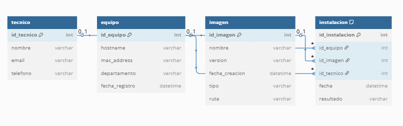

# Base de datos

## Introducción

Aunque este proyecto no se centra en el desarrollo de una aplicación web o un sistema que requiera una base de datos funcional, se incluye un modelo Entidad/Relación (E/R) que representa de forma conceptual el modelo de negocio relacionado con el entorno de automatización de instalaciones en una empresa de soporte técnico como PLEXUS TECH.

## Modelo Entidad/Relación

El siguiente esquema representa las relaciones principales entre los elementos que intervienen en la automatización del proceso de instalación y configuración de equipos.



## Descripción de las entidades

- **Equipo**  
  Contiene información de cada equipo cliente a instalar.

  Campos: `id_equipo`, `hostname`, `mac_addres`, `departamento`, `fecha_registro`.

- **Imagen**  
  Representa las imágenes de sistemas disponibles. 

  Campos: `id_imagen`, `nombre`, `version`, `fecha_creacion`, `tipo`, `ruta`.


- **Instalación**  
  Registra cada proceso de instalación realizado.

  Campos: `id_equipo`, `id_imagen`, `id_tecnico`, `fecha`, `resultado`.

- **Técnico**  
  Representa a los técnicos encargados del despliegue o mantenimiento.

  Campos: `id_tecnico`, `nombre`, `email`, `telefono`.

## Código 

Con el siguiente código es posible recrear la base de datos diseñada en un sistema gestor de datos mediante lenguaje SQL:

```sql
CREATE DATABASE IF NOT EXISTS linux_zero_touch;
USE linux_zero_touch;

CREATE TABLE tecnico (
id_tecnico INT AUTO_INCREMENT PRIMARY KEY,
nombre VARCHAR(100) NOT NULL,
email VARCHAR(100) NOT NULL,
telefono VARCHAR(20)
);

CREATE TABLE equipo (
id_equipo INT AUTO_INCREMENT PRIMARY KEY,
hostname VARCHAR(100) NOT NULL,
mac_address VARCHAR(17) NOT NULL UNIQUE,
departamento VARCHAR(100),
fecha_registro DATETIME NOT NULL
);

CREATE TABLE imagen (
id_imagen INT AUTO_INCREMENT PRIMARY KEY,
nombre VARCHAR(100) NOT NULL,
version VARCHAR(50) NOT NULL,
fecha_creacion DATETIME NOT NULL,
tipo VARCHAR(50),
ruta VARCHAR(255)
);

CREATE TABLE instalacion (
id_instalacion INT AUTO_INCREMENT PRIMARY KEY,
id_equipo INT NOT NULL,
id_imagen INT NOT NULL,
id_tecnico INT NOT NULL,
fecha DATETIME NOT NULL,
resultado VARCHAR(50),

FOREIGN KEY (id_equipo) REFERENCES equipo(id_equipo),
FOREIGN KEY (id_imagen) REFERENCES imagen(id_imagen),
FOREIGN KEY (id_tecnico) REFERENCES tecnico(id_tecnico)
);
```

## Observaciones

- Este modelo es conceptual y tiene como objetivo representar cómo se gestionaría la automatización si se necesitase persistencia de datos.
- No se implementará físicamente ninguna base de datos como parte del despliegue técnico del proyecto.
